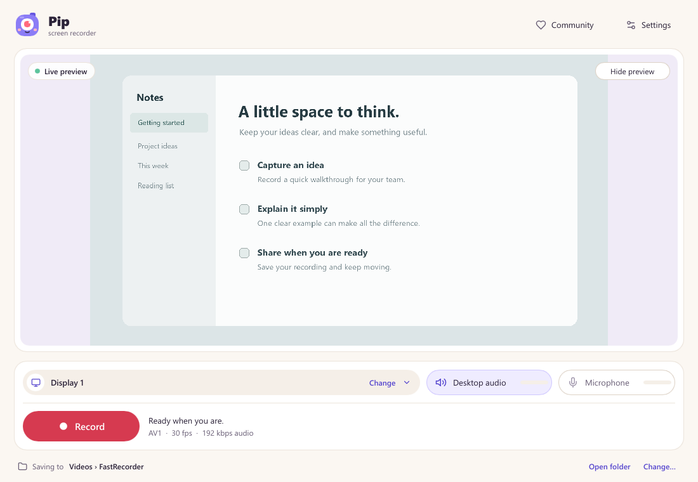
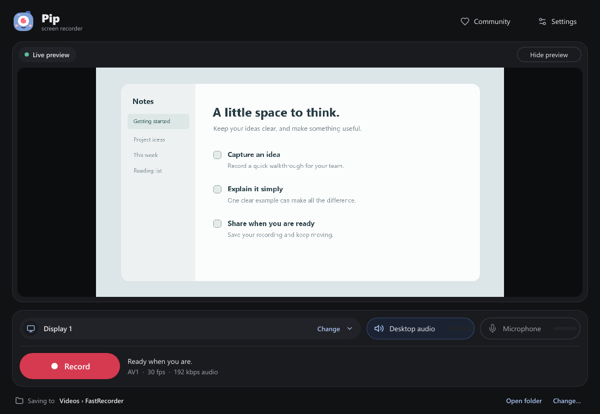
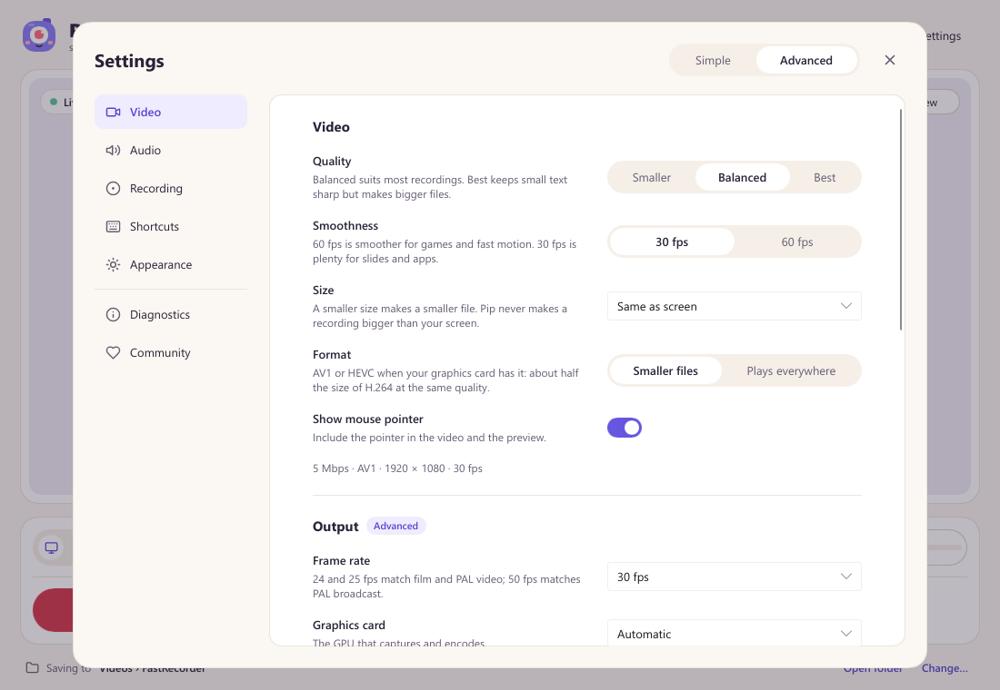
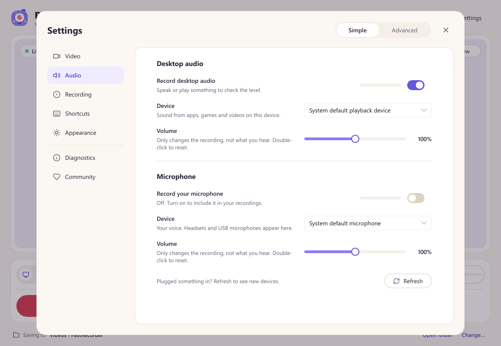
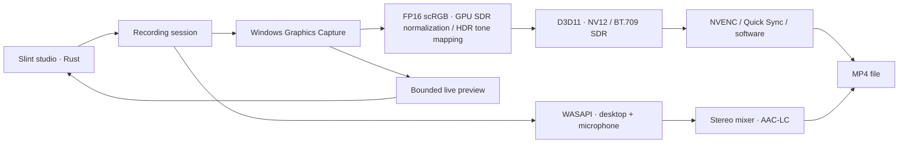
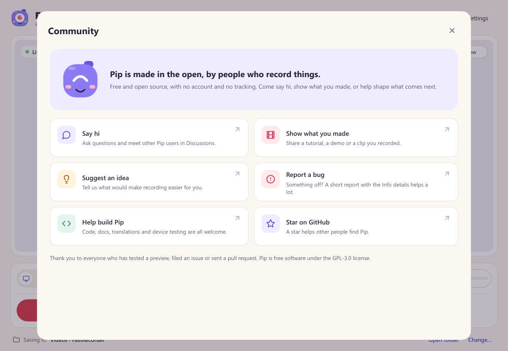

<p align="center"></p>

<h1 align="center">Pip: free, open-source screen recorder for Windows</h1>
<p align="center"><b>Record your screen with desktop audio and microphone in three clicks.</b><br>A lightweight, privacy-friendly alternative to OBS for everyday screen recording on Windows 11. No account, no watermark, no time limit and no tracking.</p>
<p align="center">
  <a href="https://github.com/neerajsunil/pip-recorder/releases"></a>
  <a href="https://github.com/neerajsunil/pip-recorder/actions/workflows/check.yml"></a>
  <a href="LICENSE"></a>
  
</p>
<p align="center">
  <a href="https://github.com/neerajsunil/pip-recorder/releases"><b>Download for Windows</b></a> ·
  <a href="#features">Features</a> ·
  <a href="#frequently-asked-questions">FAQ</a> ·
  <a href="#build-from-source">Build from source</a> ·
  <a href="#community">Community</a>
</p>


*Actual application UI with a demonstration preview. No personal desktop is shown.*

**Pip** is a simple screen recorder for Windows 11, written in Rust. It records a full display or a single app window to an MP4 video, with system sound and your microphone, using your graphics card's hardware encoder (NVIDIA NVENC or Intel Quick Sync) for small files and low CPU use. It is made for tutorials, product demos, bug reports, meetings, lessons and game clips.

## Meet Pip

Pip is a little camera with one big eye, and that eye is the record dot. Pip keeps you company in the studio: it blinks while it waits, its eye glows while you record, it smiles when your video is saved and looks worried when something needs your attention.

Pip was previously called FastRecorder, and the old repository address redirects here. The executable (`fastrecorder.exe`) and settings folder keep that name for now, so existing settings and recordings carry over.

## How to record your screen on Windows with Pip

1. Open Pip. Your main display is selected automatically.
2. Choose whether to include **Desktop audio** and your **Microphone**. Click the source bar (**Change**) for another display or an application.
3. Press **Record**. Stop from the Windows tray icon or your shortcut; your video is saved as an MP4.

The line under the studio shows where recordings are saved, with **Open folder** and **Change…**. After a recording, **Play** and **Show in folder** open it. Fresh installs record at **30 fps** with desktop audio on and the microphone off.

Settings has two levels. **Simple** shows plain choices: quality (Smaller, Balanced, Best), smoothness (30 or 60 fps), size, mouse pointer, devices and volume, countdown, what to do after saving, and the theme (System, Light or Dark). **Advanced** adds OBS-style controls: exact frame rate, GPU and encoder, rate control (VBR, CBR, CQP), bitrate and peak bitrate, keyframe interval, and for NVIDIA the preset, tuning, multipass, look-ahead, spatial and temporal AQ and max B-frames. It also adds the software AV1 speed, audio quality, a file-name pattern, process priority and an automatic stop time. **Format** chooses between smaller files (AV1 or HEVC) and **Plays everywhere** (H.264).





## Download

**[Download Pip for Windows x64 →](https://github.com/neerajsunil/pip-recorder/releases)**

Extract the Windows x64 ZIP, then open `fastrecorder.exe`. No account, subscription, watermark, recording time limit or FFmpeg installation is required. Recordings stay on your computer; Pip has no telemetry or upload service.

**Requirements:** Windows 11 on an x64 processor, current graphics drivers and Windows Media Foundation. Windows N editions need Microsoft's [Media Feature Pack](https://support.microsoft.com/windows/media-feature-pack-for-windows-n-8622b390-4ce6-43c9-9b42-549e5328e407). If Windows reports a missing `VCRUNTIME` DLL, install the [Microsoft Visual C++ x64 runtime](https://learn.microsoft.com/cpp/windows/latest-supported-vc-redist). AV1/HEVC playback depends on your player and installed decoding support.

**Release status:** early preview. Windows x64 builds are available; recording, audio synchronization and restore behavior still need broader device testing. Do not rely on the preview for an irreplaceable recording without checking it first. [Release readiness](docs/RELEASE_READINESS.md) documents the remaining work.

## Features

- Record a full display or an application window, with a live preview.
- Include desktop sound, microphone audio, both, or neither.
- Choose audio devices and adjust their recording volumes.
- Check live desktop/microphone levels before and during recording, with device and microphone-permission guidance.
- Capture HDR displays as ordinary SDR video, with the same GPU tone mapping in the preview.
- Record **AV1, HEVC/H.265 or H.264** on supported NVIDIA and Intel GPUs; software H.264 and AV1 are also available.
- Let Automatic choose the best available encoder, or choose it yourself.
- Pick Recommended, High, Low or Custom bitrate, plus advanced quality controls.
- Record at 24, 25, 30, 50 or 60 fps, at the screen's size or scaled down to 2160p, 1440p, 1080p or 720p.
- Include or exclude the mouse cursor, start with a 3, 5 or 10 second countdown, and stop automatically after a set time.
- Choose a save folder, and have Pip show or play each recording when it's saved.
- Use a light or dark theme, or follow Windows.
- Start and stop with configurable global keyboard shortcuts, or stop through the Windows tray.
- Keep settings across launches and play or reveal your last recording.

Default shortcuts: **Ctrl+Shift+F9** to start, **Ctrl+Shift+F10** to stop. Assign the same shortcut to both actions to toggle recording. Default filenames use `YYYY-MM-DD-HH-mm-ss.mp4` in your Windows Videos/FastRecorder folder.



## Platform support

This table is the source of truth for supported operating systems and CPU architectures. Planned platforms do not yet have a recording backend or downloadable release.

| Platform | Architecture | Status | Capture backend |
|---|---|---|---|
| Windows 11 | x64 (64-bit Intel/AMD) | **Available · preview** | Windows Graphics Capture |
| Windows 11 | ARM64 | Planned | Windows Graphics Capture |
| macOS | ARM64 (Apple Silicon) | Planned | ScreenCaptureKit |
| Linux | x64 | Planned | Desktop portal / PipeWire |
| Linux | ARM64 | Planned | Desktop portal / PipeWire |

32-bit Windows and Intel macOS are outside the planned scope. Architecture support is separate from GPU codec support.

| Video encoder | AV1 | HEVC | H.264 | Current path |
|---|:---:|:---:|:---:|---|
| NVIDIA NVENC | ✓* | ✓* | ✓* | GPU textures, direct driver API |
| Intel Quick Sync | ✓* | ✓* | ✓* | oneVPL / Media SDK, bounded readback |
| AMD / other Windows GPUs | — | — | ✓* | Media Foundation hardware fallback |
| Software | ✓ | — | ✓ | rav1e / Windows Media Foundation |

*Availability depends on the GPU, driver, resolution and settings. Unsupported choices are hidden. AMD AV1/HEVC support is planned; this release does not claim direct AMF or D3D12 video encoding.*

## How it works

<details>
<summary>Architecture, capture pipeline and encoder defaults</summary>


Pip uses **Rust** and **Slint** (software renderer) for the UI, a native **Direct3D 11** surface for the live preview, **Windows Graphics Capture** for native display/window capture, and **WASAPI** for desktop and microphone audio. It uses installed hardware encoders directly where supported, with software fallback.



Windows Graphics Capture delivers D3D11 textures, so capture, preview and encoding all stay on D3D11. SDR displays are captured as 8-bit BGRA; HDR displays use FP16, which preserves HDR values until a GPU shader normalizes SDR white and maps HDR highlights into SDR; output remains 8-bit BT.709, not an HDR recording. NVIDIA video pixels stay on the GPU; Intel and software encoding currently use bounded readback. The live preview never touches the CPU and never makes the interface redraw: the capture GPU scales each frame into a native window over the preview panel and presents it, at up to 30 fps. It pauses while minimized or hidden. Typical use on a 1440p display: about 110 MB and a few percent of one CPU core while idle with the preview on, and about 400 MB while recording. Audio uses a shared clock, bounded PCM storage, and stereo AAC-LC at 48 kHz/192 kbps. Enabled audio sources are mixed into one track. Idle audio meters discard packets without saving sound and stop while the studio is minimized.

For recording quality, NVENC defaults to P5/HQ, VBR, spatial AQ, quarter-resolution multipass and up to two B-frames, with optional CQP. Look-ahead is off by default (it costs about 150 MB) and can be turned on in Advanced. B-frame references are enabled where supported; buffering is bounded and unsupported enhancements fall back automatically. Intel requests TU1 quality and up to three B-frames. Pip has **not** been benchmarked as better than OBS. See [technical and development notes](docs/DEVELOPMENT.md) for bitrate tables, fallbacks, limitations and build instructions.

</details>

## Frequently asked questions

**Is Pip free?**
Yes. Pip is free and open source under GPL-3.0. There is no paid tier, watermark, ads or recording time limit.

**How do I record my screen with audio on Windows 11?**
Open Pip, leave **Desktop audio** on (and turn on **Microphone** if you want your voice), then press **Record**. The video is saved as an MP4 in your Videos folder.

**Can Pip record a single window instead of the whole screen?**
Yes. Click the source bar and pick any open application window, or another display.

**Is Pip an alternative to OBS Studio?**
For everyday screen recording, yes: Pip opens straight to a Record button and picks sensible defaults. Its Advanced settings expose OBS-style encoder controls (rate control, bitrate, presets, B-frames, look-ahead). Pip does not do live streaming, scenes or overlays; use OBS for those.

**Does Pip upload my recordings or collect data?**
No. Recordings stay on your computer. Pip has no account, telemetry or upload service.

**Which video formats and encoders does Pip support?**
MP4 with AV1, HEVC (H.265) or H.264 video and AAC audio. Pip uses NVIDIA NVENC and Intel Quick Sync where available, Media Foundation on other GPUs, and software encoders as a fallback. Choose **Plays everywhere** for H.264 files that open on any device.

**Can I record HDR displays?**
Yes. HDR displays are tone-mapped on the GPU into normal SDR video, so recordings look right in any player.

**Does Pip work on macOS or Linux?**
Not yet. Windows 11 x64 is available now; Windows ARM64, macOS (Apple Silicon) and Linux are planned. See [platform support](#platform-support).

## Roadmap

- Windows ARM64, followed by macOS Apple Silicon and Linux x64/ARM64.
- Crash-resilient recording files and recovery.
- Region capture and pause/resume.
- AMD AV1/HEVC and GPU-resident Intel encoding.
- Separate audio tracks and live mute.
- HDR output, broader device testing and signed Windows distribution.

These are planned features, not availability promises. [Suggest a feature](https://github.com/neerajsunil/pip-recorder/issues/new?template=feature_request.yml) or [report a bug](https://github.com/neerajsunil/pip-recorder/issues/new?template=bug_report.yml).

## Build from source

Install stable Rust for `x86_64-pc-windows-msvc` and Visual Studio C++ Build Tools with a Windows SDK.

```powershell
git clone https://github.com/neerajsunil/pip-recorder.git
cd pip-recorder
cargo build -p fastrecorder --release --locked
.\target\release\fastrecorder.exe
```

Use `.\run.ps1 -SoftwareUI` for graphics troubleshooting. [CONTRIBUTING.md](CONTRIBUTING.md) explains the workflow; [docs/ARCHITECTURE.md](docs/ARCHITECTURE.md) maps the workspace; [docs/DEVELOPMENT.md](docs/DEVELOPMENT.md) has technical notes and optional diagnostic commands.

## Community

Pip is made in the open, by people who record things. The **Community** button in the app links to the same places:

- **Say hi and get help** in [Discussions](https://github.com/neerajsunil/pip-recorder/discussions).
- **Show what you made** in [Show and tell](https://github.com/neerajsunil/pip-recorder/discussions/categories/show-and-tell): tutorials, demos, bug repros, game clips.
- **Suggest an idea** in [Ideas](https://github.com/neerajsunil/pip-recorder/discussions/categories/ideas), or [report a bug](https://github.com/neerajsunil/pip-recorder/issues/new?template=bug_report.yml).
- **Help build Pip.** Code, documentation, translations, accessibility feedback and device test reports are all welcome. Start with the [contribution guide](CONTRIBUTING.md) and [good first issues](https://github.com/neerajsunil/pip-recorder/contribute).



Everyone is expected to follow the [code of conduct](CODE_OF_CONDUCT.md). Report security problems privately using [SECURITY.md](SECURITY.md).

## License

**GPL-3.0-only.** Pip is free and open source; distributions must comply with [LICENSE](LICENSE). Slint is used under its GPL option. Icons are [Lucide](https://lucide.dev), licensed ISC. Driver/header and dependency notices are in [THIRD_PARTY_NOTICES.md](THIRD_PARTY_NOTICES.md).

<sub>Keywords: screen recorder for Windows, free screen recorder, open-source screen recorder, record screen with audio, Windows 11 screen recording, OBS alternative, lightweight screen recorder, no watermark, AV1 / HEVC / H.264, NVENC, Quick Sync, Rust, Slint.</sub>
