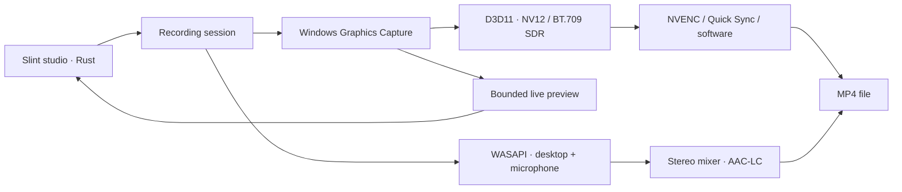

<p align="center"></p>

<h1 align="center">FastRecorder</h1>
<p align="center">A free, open-source screen recorder for Windows. Record your screen, desktop sound and microphone in a simple native app.</p>
<p align="center">
  <a href="https://github.com/neerajsunil/FastRecorder/releases"></a>
  <a href="https://github.com/neerajsunil/FastRecorder/actions/workflows/check.yml"></a>
  <a href="LICENSE"></a>
</p>


*Actual application UI with a demonstration preview. No personal desktop is shown.*

## Record in three steps

1. Open FastRecorder. Your main display is selected automatically.
2. Choose whether to include **Desktop audio** and your **Microphone**. Use **Change source** for another display or an application.
3. Press **Record**. Stop from the Windows tray icon or your shortcut; your video is saved as an MP4.

The studio shows the video format and frame rate. More detailed controls are in Settings. Recording starts at **30 fps** by default, desktop audio is enabled, and the microphone stays off until you enable it.

## Download

**[Download FastRecorder for Windows x64 →](https://github.com/neerajsunil/FastRecorder/releases)**

Extract the Windows x64 ZIP, then open `fastrecorder.exe`. No account, subscription, watermark, recording time limit or FFmpeg installation is required. Recordings stay on your computer; FastRecorder has no telemetry or upload service.

**Requirements:** Windows 11 on an x64 processor, current graphics drivers and Windows Media Foundation. Windows N editions need Microsoft's [Media Feature Pack](https://support.microsoft.com/windows/media-feature-pack-for-windows-n-8622b390-4ce6-43c9-9b42-549e5328e407). If Windows reports a missing `VCRUNTIME` DLL, install the [Microsoft Visual C++ x64 runtime](https://learn.microsoft.com/cpp/windows/latest-supported-vc-redist). AV1/HEVC playback depends on your player and installed decoding support.

**Release status:** early preview. Windows x64 builds are available; recording, audio synchronization and restore behavior still need broader device testing. Do not rely on the preview for an irreplaceable recording without checking it first. [Release readiness](docs/RELEASE_READINESS.md) documents the remaining work.

## What you can do

- Record a full display or an application window, with a live preview.
- Include desktop sound, microphone audio, both, or neither.
- Choose audio devices and adjust their recording volumes.
- Record **AV1, HEVC/H.265 or H.264** on supported NVIDIA and Intel GPUs; software H.264 and AV1 are also available.
- Let Automatic choose the best available encoder, or choose it yourself.
- Pick Recommended, High, Low or Custom bitrate, plus advanced quality controls.
- Record at 30 or 60 fps, include/exclude the mouse cursor, and choose a save location.
- Start and stop with configurable global keyboard shortcuts, or stop through the Windows tray.
- Keep settings across launches and play or reveal your last recording.

Default shortcuts: **Ctrl+Shift+F9** to start, **Ctrl+Shift+F10** to stop. Assign the same shortcut to both actions to toggle recording. Default filenames use `YYYY-MM-DD-HH-mm-ss.mp4` in your Windows Videos/FastRecorder folder.


## Platform support

This table is the source of truth for supported operating systems and CPU architectures. Planned platforms do not yet have a recording backend or downloadable release.

| Platform | Architecture | Status | Capture backend |
|---|---|---|---|
| Windows 11 | x64 (64-bit Intel/AMD) | **Available · preview** | Windows Graphics Capture |
| Windows 11 | ARM64 | Planned | Windows Graphics Capture |
| macOS | ARM64 (Apple Silicon) | Planned | ScreenCaptureKit |
| Linux | x64 | Planned | Desktop portal / PipeWire |
| Linux | ARM64 | Planned | Desktop portal / PipeWire |

32-bit Windows and Intel macOS are outside the planned scope. Architecture support is separate from GPU codec support.

| Video encoder | AV1 | HEVC | H.264 | Current path |
|---|:---:|:---:|:---:|---|
| NVIDIA NVENC | ✓* | ✓* | ✓* | GPU textures, direct driver API |
| Intel Quick Sync | ✓* | ✓* | ✓* | oneVPL / Media SDK, bounded readback |
| AMD / other Windows GPUs | — | — | ✓* | Media Foundation hardware fallback |
| Software | ✓ | — | ✓ | rav1e / Windows Media Foundation |

*Availability depends on the GPU, driver, resolution and settings. Unsupported choices are hidden. AMD AV1/HEVC support is planned; this release does not claim direct AMF or D3D12 video encoding.*

## How it works

FastRecorder uses **Rust**, **Slint**, **WGPU/Direct3D 12** for the UI, **Windows Graphics Capture** for native display/window capture, and **WASAPI** for desktop and microphone audio. It uses installed hardware encoders directly where supported, with software fallback.



Windows Graphics Capture delivers D3D11 textures, so capture processing uses D3D11 even though UI rendering uses Direct3D 12. NVIDIA video pixels stay on the GPU; Intel and software encoding currently use bounded readback. The preview is limited to 960 × 540 at 12 fps and pauses while minimized. Audio uses a shared clock, bounded PCM storage, and stereo AAC-LC at 48 kHz/192 kbps. Enabled audio sources are mixed into one track.

For recording quality, NVENC defaults to P5/HQ, VBR, spatial AQ and quarter-resolution multipass, with optional CQP. Intel requests TU1 quality. FastRecorder has **not** been benchmarked as better than OBS. See [technical and development notes](docs/DEVELOPMENT.md) for bitrate tables, fallbacks, limitations and build instructions.

## Roadmap

- Windows ARM64, followed by macOS Apple Silicon and Linux x64/ARM64.
- Crash-resilient recording files and recovery.
- Region capture, output scaling, pause/resume and countdown.
- AMD AV1/HEVC and GPU-resident Intel encoding.
- Separate audio tracks, live mute and audio meters.
- HDR handling, broader device testing and signed Windows distribution.

These are planned features, not availability promises. [Suggest a feature](https://github.com/neerajsunil/FastRecorder/issues/new?template=feature_request.yml) or [report a bug](https://github.com/neerajsunil/FastRecorder/issues/new?template=bug_report.yml).

## Build from source

Install stable Rust for `x86_64-pc-windows-msvc` and Visual Studio C++ Build Tools with a Windows SDK.

```powershell
git clone https://github.com/neerajsunil/FastRecorder.git
cd FastRecorder
cargo build -p fastrecorder --release --locked
.\target\release\fastrecorder.exe
```

Use `.\run.ps1 -SoftwareUI` for graphics troubleshooting. [CONTRIBUTING.md](CONTRIBUTING.md) explains the workflow; [docs/DEVELOPMENT.md](docs/DEVELOPMENT.md) has deeper architecture and optional diagnostic commands.

## Contribute and support

Bug reports, device compatibility reports, accessibility feedback, documentation and code contributions are welcome. Please read the [contribution guide](CONTRIBUTING.md) and [code of conduct](CODE_OF_CONDUCT.md). Report security problems privately using [SECURITY.md](SECURITY.md). For usage help, use [GitHub Discussions](https://github.com/neerajsunil/FastRecorder/discussions).

## License

**GPL-3.0-only.** FastRecorder is free and open source; distributions must comply with [LICENSE](LICENSE). Slint is used under its GPL option. Icons are [Lucide](https://lucide.dev), licensed ISC. Driver/header and dependency notices are in [THIRD_PARTY_NOTICES.md](THIRD_PARTY_NOTICES.md).
