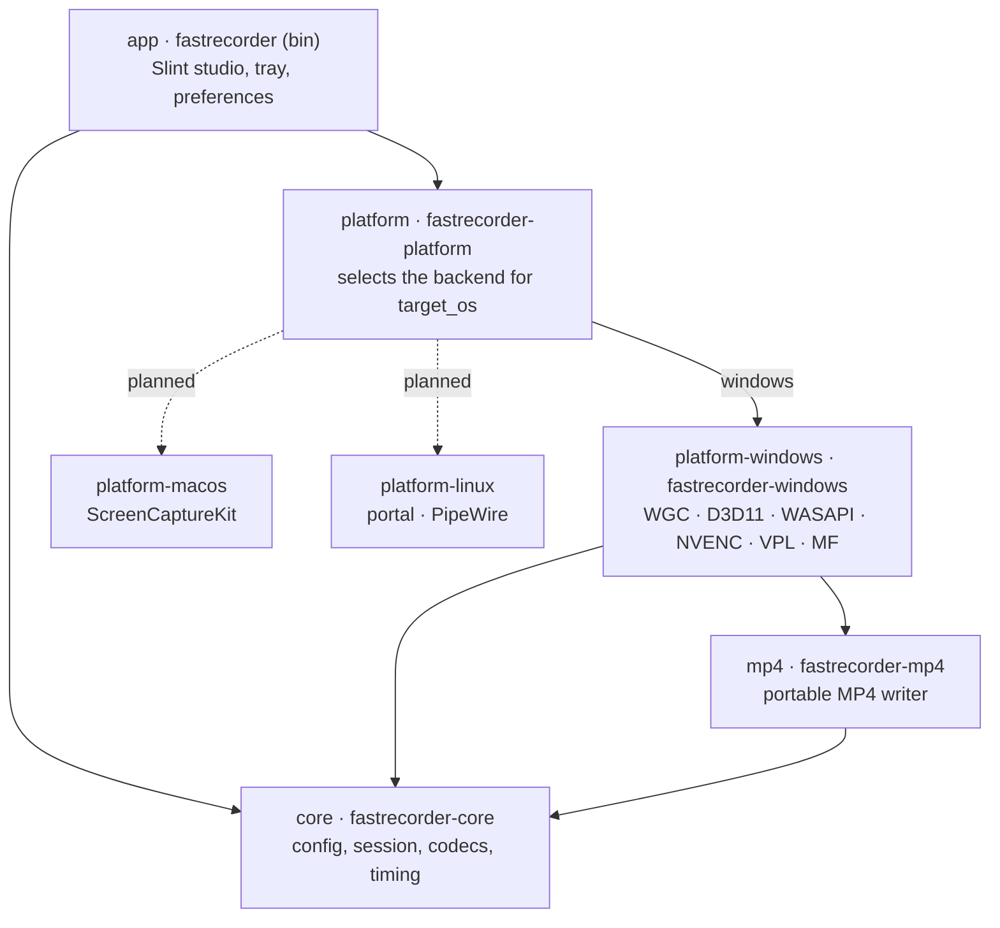

# Architecture and repository layout

FastRecorder is a Cargo workspace split by **portability**. Code that can run anywhere lives in portable crates that build and are tested on every CI host. OS-specific capture, audio and encoding live in one backend crate per platform. The app reaches a backend only through a facade crate.



## Layering rules

1. **`core` and `mp4` are portable.** They use only `std` and must pass `cargo clippy` and `cargo test` on Windows, Linux (x64 and ARM64) and macOS. CI enforces this. Pure logic, such as muxing, timestamp math, bitrate policy or validation, belongs in these crates, where it can be tested without hardware.
2. **The app never names a backend crate.** It depends on `fastrecorder-platform`. Each backend exposes the same set of public names, and the facade re-exports the backend that matches `target_os`.
3. **Native handles stay inside the backend.** Only plain data, preview pixels and `RecordingEvent`s cross into the UI. Recording, audio and preview work runs on backend-owned threads. Buffers are bounded.
4. **The Slint `MainWindow` API is a contract.** Rust drives the UI through `MainWindow`'s properties and callbacks. Pages and widgets can be restructured freely if those names stay the same.

## Directory map

```text
crates/
├─ core/                    fastrecorder-core: platform-neutral domain
│  └─ src/  config.rs (RecordingConfig, AudioConfig, validation)
│           session.rs (Session state machine) · codec.rs · bitrate.rs · timing.rs
├─ mp4/                     fastrecorder-mp4: portable ISO BMFF writer
│  ├─ src/  writer.rs (Mp4Writer) · audio.rs (AacTrack, attach_audio)
│  │        av1.rs (OBU / av1C) · nal.rs (Annex B / avcC / hvcC) · boxes.rs
│  └─ tests/mux.rs          structural tests that parse the produced box tree
├─ platform/                fastrecorder-platform: compile-time backend facade
├─ platform-windows/        fastrecorder-windows: Windows 11 backend
│  ├─ build.rs              compiles capture/color.hlsl and encode/intel/bridge.cpp
│  ├─ vendor/vpl/           Intel oneVPL / Media SDK headers (MIT)
│  └─ src/
│     ├─ capture/           WGC sources, sessions, frame lifetimes, HDR→SDR shader
│     ├─ pipeline/          Recording worker: temp file → capture loop → finalize
│     │                     convert.rs (scRGB → NV12) · worker.rs
│     ├─ encode/            VideoEncoder selection and fallback order
│     │  ├─ nvenc/          direct NVENC: session.rs · slot.rs · api/ (vendored ABI)
│     │  ├─ intel/          oneVPL via bridge.cpp
│     │  ├─ media_foundation.rs · software_av1.rs (rav1e)
│     ├─ audio/             devices · endpoint (WASAPI) · mixer · aac · monitor · recording
│     ├─ preview.rs · gpu.rs · shell.rs · files.rs · shortcut.rs
│     └─ validation.rs      decode check, `diagnostics` feature only
└─ app/                     fastrecorder: the executable
   ├─ assets/               icon, Windows manifest
   ├─ ui/
   │  ├─ main.slint         studio window and the Rust-facing MainWindow API
   │  ├─ components/        ActionButton, AudioMeter, labels, SourceRow
   │  ├─ pages/             video, audio, shortcuts, general, info, source-picker
   │  └─ icons/             Lucide (ISC)
   └─ src/
      ├─ main.rs · cli.rs   startup, GPU→software UI fallback, flags
      ├─ studio/            one module per UI area, each with `install(ui, state)`:
      │                     audio · destination · encoding · preview · recording
      │                     settings · shortcuts · sources · surface · notify · state
      ├─ preferences.rs · tray.rs · logging.rs
      └─ docs.rs            README screenshots, `diagnostics` feature only
docs/  scripts/  .github/workflows/
```

## Where does new code go?

| Change | Location |
|---|---|
| A setting that affects recording | `core/config.rs` (field + validation), then its studio module and page |
| MP4 or container behavior | `mp4/`, with a test in `mp4/tests/mux.rs` |
| A new Windows encoder | `platform-windows/src/encode/<name>/`, plus a case in `encode/mod.rs` |
| A new settings page | `app/ui/pages/<name>.slint`, wired in `main.slint` |
| Reacting to a new UI callback | the matching `app/src/studio/<area>.rs` `install` function |

## Adding a platform backend

1. Create `crates/platform-<os>` (for example `fastrecorder-macos`). Gate its `lib.rs` with `#![cfg(target_os = "…")]` so the crate builds empty elsewhere.
2. Export the same public names as `fastrecorder-windows/src/lib.rs`. The app currently uses capture sources and enumeration, `Preview`/`PreviewChannel`, `Recording`/`RecordingEvent`, audio inventory and metering, GPU inventory, shortcuts, the shell helpers (dialogs, open/reveal, window styling) and the file helpers (default folder, preferences path and atomic save).
3. Mux through `fastrecorder-mp4`, and take configuration from `fastrecorder-core`. Do not duplicate either.
4. Add the crate under a `[target.'cfg(target_os = "…")'.dependencies]` table in `crates/platform/Cargo.toml`, re-export it in `crates/platform/src/lib.rs`, and update `RECORDING_SUPPORTED` / `BACKEND`.
5. Gate the app's OS-specific modules (`tray`, `studio`) on the new target as well, and add a CI job.
6. Update the README platform table only after recording and release are verified on real hardware.

A compile-time facade was chosen over trait objects for two reasons. Each backend owns threads and native handles with very different lifetimes, and there is exactly one backend per build. If a second backend shows the shared surface is stable, it can be formalized as traits in `core`.

## CPU architectures

The workspace has no architecture-specific code outside vendor runtimes, which are loaded at run time. Windows ARM64 needs the backend built for `aarch64-pc-windows-msvc`. NVENC and Intel VPL will be unavailable there, and the Media Foundation and rav1e paths remain. Portable crates are already tested on Linux ARM64 and Apple Silicon in CI.
